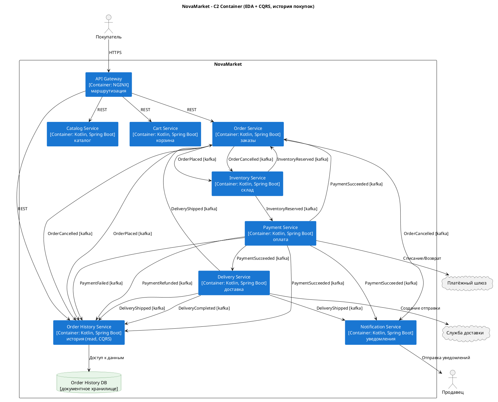

### **Название задачи:** Задание 2. Получите агрегированные данные на фронтенде

### **Автор:** Алексей Киселёв

### **Дата:** 17.09.2026

### **Функциональные требования**

| **№** | **Действующие лица или системы**                   | **Use Case**            | **Описание**                                                                             |
| :---: | :------------------------------------------------- | :---------------------- | :--------------------------------------------------------------------------------------- |
| UC-01 | Покупатель, API Gateway, Order History Service     | Просмотр списка заказов | Покупатель открывает историю покупок и видит заказы: сумма, дата, способ доставки        |
| UC-02 | Покупатель, API Gateway, Order History Service     | Просмотр деталей заказа | Покупатель открывает заказ: состав, количество, цены, оплата, доставка, финальный статус |
| UC-03 | Покупатель, Order History Service, Catalog Service | Чек / повтор / отзыв    | Скачать чек, заказать товар снова, оставить отзыв                                        |

### **Нефункциональные требования**

| **№**  | **Требование**                                                                   |
| :----: | :------------------------------------------------------------------------------- |
| NFR-01 | Отклик экрана истории покупок <= 1с (99.99%), целевой 0.3с (98%)                 |
| NFR-02 | Возможность масштабировать сервисы                                               |
| NFR-03 | Возможность добавлять подписчиков на события без изменения существующих сервисов |

### **Решение**

Выбран паттерн **CQRS**, додавляем **Order History Service** (read model).
Он подписывается на события Order / Payment / Delivery (Kafka),
строит денормализованное представление в своей БД.
Клиент через API Gateway (NGINX) читает только этот сервис.
Оформление заказа не меняется.

[c2_container.puml](c2_container.puml) / [c2_container.png](c2_container.png)

Логика выбора:

- Один быстрый запрос к read-модели вместо нескольких обращений к разным сервисам для соблюдения SLA.
- Уже есть события и можно легко построить проекцию.
- Write и read масштабируются отдельно.

### **Альтернативы**

1. **API Composition** - Gateway/BFF собирает историю синхронными вызовами Order, Payment, Delivery, Catalog.
  Плюсы: просто на старте, без новой БД.
  Минусы: N+1 вызовы, хрупкий SLA при росте.

2. **Event Sourcing на все сервисы** - полный журнал событий.
  Плюсы: аудит.
  Минусы: высокая сложность для MVP, избыточена по сравнению с CQRS-проекций.

#### **Недостатки, ограничения, риски**

- Eventual consistency: задержка проекции после события.
- Дублирование данных в read DB.
